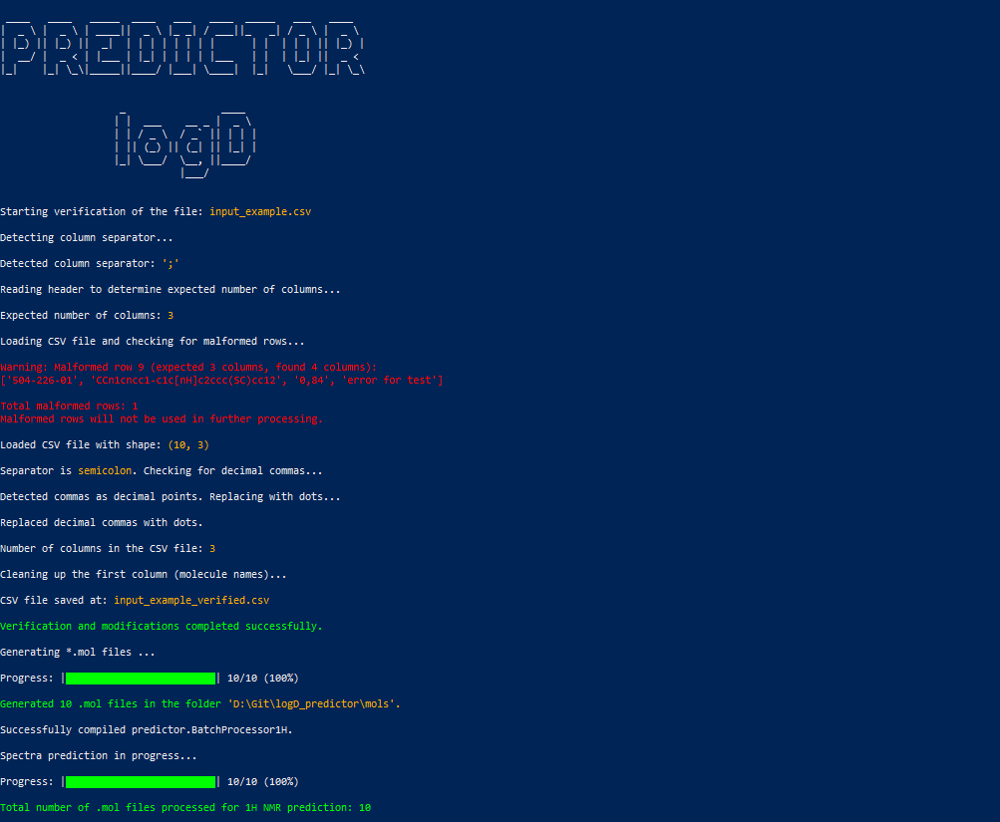
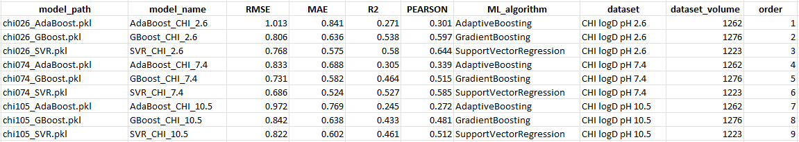

# README for logD_predictor Project

## logD Predictor

logD_predictor is a versatile command-line tool designed to predict the distribution coefficient (logD) of chemical compounds based on theoretical NMR spectra. This pipeline facilitates the complete workflow, starting from processing SMILES strings to predicting NMR spectra, bucketing, and generating machine learning model predictions for logD at different pH levels.

The tool uses the NMRshiftDB2 predictor, which can be accessed here.

# An example of the finished script run

The script was run as an example for the prediction of 1H NMR spectra with an input file containing a misdefined one of the rows. In addition, a comma was inserted as the decimal separator and a semicolon was inserted as the column separator. Generally created models without hyperparameter optimization were used, the prediction results are not accurate and relevent.




## Table of Contents
- [README](#readme)
- [An example of the finished script run](#An-example-of-the-finished-script-run)
- [Features](#features)
- [Installation](#installation)
- [Usage](#usage)
- [Input File Format](#input-file-format)
- [Output File Description](#output-file-description)
- [Project Structure](#project-structure)
- [Dependencies](#dependencies)
- [Troubleshooting](#troubleshooting)
- [License](#license)

## Features

- **CSV File Verification**: Automatically detects separators, checks for decimal inconsistencies, and cleans molecule names to ensure consistent input files.
- **Molecule File Generation**: Converts SMILES strings from the CSV input to .mol files, suitable for further processing.
- **NMR Spectra Prediction**: Uses a Java-based batch processor from the NMRshiftDB2 predictor to generate theoretical NMR spectra for 1H and 13C nuclei.
- **Spectra Bucketing**: Converts continuous spectra data into discrete buckets for machine learning model compatibility.
- **Model Querying**: Queries pre-trained machine learning models to predict logD values based on the bucketed NMR spectra.
- **Automated Cleanup**: Option to remove all temporary files generated during the execution.

## Installation

- Clone the repository:

  ```bash
  git clone https://github.com/yourusername/logD_predictor.git
  cd logD_predictor
  ```

- Install required Python packages:

  ```bash
  python install_modules.py
  ```

- Set up Java environment:
  - Install the Java SDK, ensuring that `javac` and `java` commands are accessible in your system's PATH.
  - The script uses Java batch processors located in the predictor directory. Ensure that the `.jar` and `.java` files are correctly configured.

## Usage

Run the following command for the complete workflow:

```bash
python logD_predictor.py --csv_path my_input.csv --predictor 1H --models --clean
```

- Replace `my_input.csv` with the path to your input file containing SMILES codes.
- The `--models` flag shows details of the models used during prediction.
- The `--clean` flag removes all intermediate files after execution. Omit this flag if you wish to keep the intermediate files for debugging.

### Argument `--models`
If you include the `--models` argument when running the script, the tool will display detailed metrics for the machine learning models used during prediction. These metrics include model names, algorithms, datasets used, and post-training performance metrics such as RMSE, MAE, R2, and PEARSON correlation.

## Input File Format

The input should be a CSV file with SMILES strings in the first column. Additional metadata columns are optional but will not be used by the tool.

## Output File Description

The output will be stored in the `logD_results/` directory and will contain the predicted logD values.

## Project Structure

The following directory structure is used:

```
logD_predictor/
│
├── logD_predictor.py              # Main script for executing the pipeline
├── install_modules.py             # Installs required Python packages
├── predictor/
│   ├── predictorh.jar             # Java-based predictor for 1H spectra
│   ├── predictor13C.jar           # Java-based predictor for 13C spectra
│   ├── cdk-2.9.jar                # CDK library required for spectrum prediction.
│   ├── BatchProcessor1H.java      # Java batch processor for 1H spectra
│   └── BatchProcessor13C.java     # Java batch processor for 13C spectra
├── logD_predictor_bin/            # Directory containing modules
│   ├── joblib_models/             # Directory containing models and their definitions
│   │   ├── 1H_models_info.csv     # 1H models definitions
│   │   ├── 13C_models_info.csv    # 13C models definitions
│   ├── csv_checker.py             # Verifies and preprocesses CSV files
│   ├── gen_mols.py                # Generates .mol files from SMILES strings
│   ├── bucket.py                  # Buckets NMR spectra
│   ├── merger.py                  # Merges bucketed spectra CSVs
│   ├── custom_header.py           # Adds custom headers to the final dataset
│   └── model_query.py             # Queries machine learning models
├── input_example.csv              # Sample input CSV file with SMILES strings
├── logD_results/                  # Directiry with query logD results 
└── README.md                      # Project documentation (this file)
```

### `joblib_models` Directory
The `joblib_models` directory contains CSV files that define the models used for predicting CHI logD values. Each CSV file corresponds to a different type of NMR spectrum (e.g., `1H_models_info.csv`, `13C_models_info.csv`). These files include information such as:
- **Model Name**: The name of the machine learning model.
- **Model Path**: The path to the pre-trained model saved in `.joblib` format.
- **Performance Metrics**: Metrics like RMSE, MAE, R2, and PEARSON that summarize the model's performance.

Ensure that the correct model definition files are present in this folder before running predictions. The script will load the models dynamically from these CSV files and apply them to the processed NMR spectra.

### Structure of model definitions file



Structure of the file with model definitions located in the logD_predictor_bin\joblib_models directory. The content of each column is self-explanatory except for the **order** column. This is the order in which the result columns for each model are displayed in the terminal and written to the result files. This is convenient, for sorting the results by parameter or model, for example, rather than the default - alphabetically.

## Dependencies

- Python 3.x
- RDKit
- Optuna
- Numpy, Pandas, etc.
- Java SDK for NMR predictor

## Troubleshooting

If you encounter issues with missing files or errors during execution, ensure that the required Java environment is properly set up and that the CSV input files are formatted correctly.

## License

This project is licensed under the MIT License.
