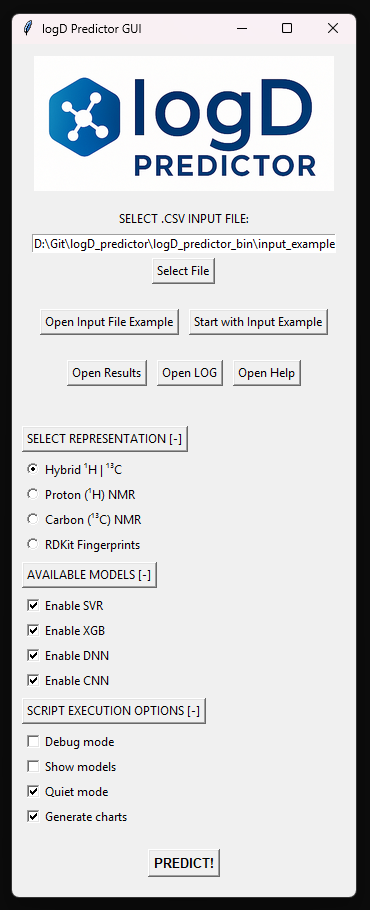
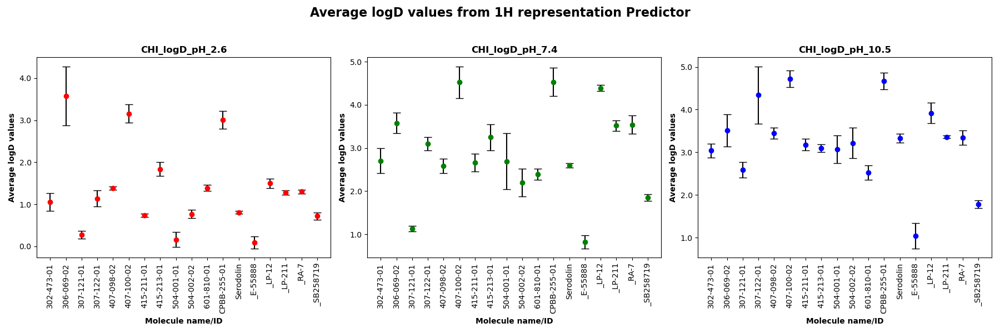
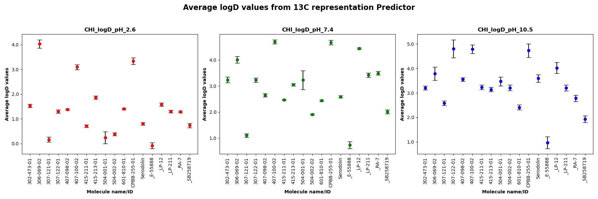
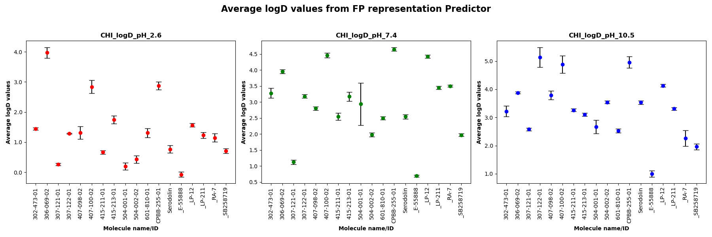
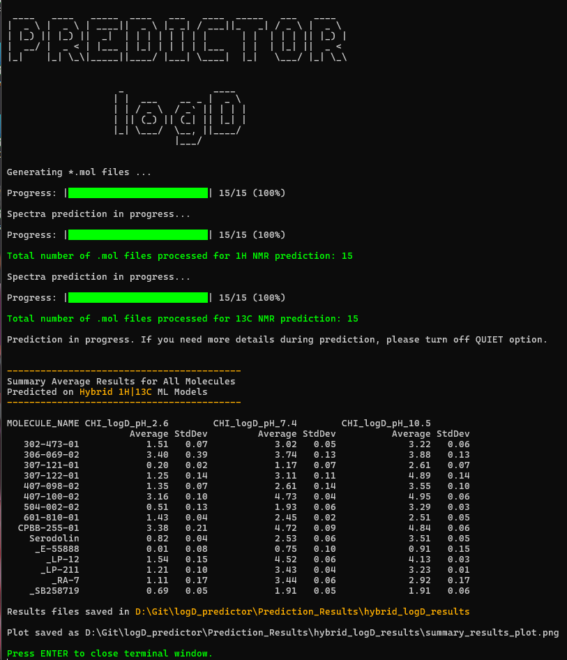
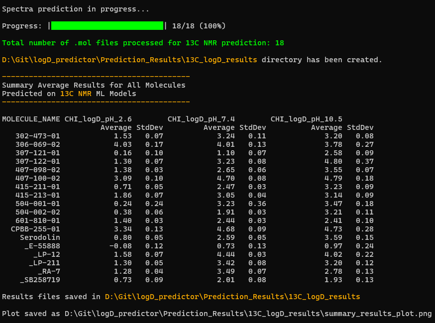
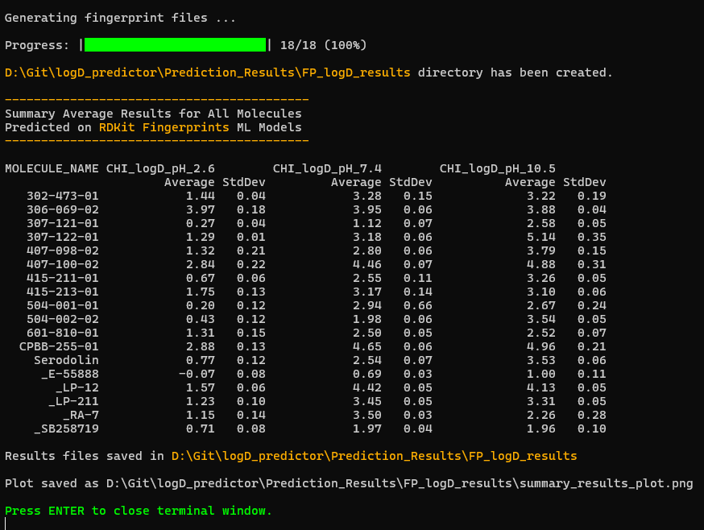

# logD Predictor

**logD Predictor** is a graphical application for the prediction of the **CHI logD** parameter based on machine learning (ML) and deep learning models trained on **¹H and ¹³C NMR spectral representations**. Additionally, it supports predictions based on **RDKit-generated molecular fingerprints**.  

The tool is built entirely in **Python** and integrates a graphical user interface (GUI) for both installation and usage. It incorporates the core functionality of the [Demiurge](https://github.com/Prospero1988/Demiurge) pipeline, with additional layers for model selection, prediction, and result visualization. All models used in the application were trained on datasets containing over 1,200 compounds and underwent full hyperparameter optimization using [Optuna](https://optuna.org/).

For more detailed information, check the original research paper:
(placeholder for DOI and link after publication)

If you use this software in your research, please cite our publication once available.
---

## 📑 Table of Contents
- [Key Features](#-key-features)
- [Repository Structure](#-repository-structure)
- [Installation](#️-installation)
- [Running the Application](#-running-the-application)
- [Input File Format](#-input-file-format)
- [Prediction Options](#-prediction-options-via-gui)
- [Preview of the Interface](#-preview-of-the-interface)
- [Examples of Working Program](#-examples-of-working-program)
- [Related Projects](#-related-projects)
- [Troubleshooting](#-troubleshooting)
- [License](#-license)

---

## 💡 Key Features
- Spectral-based prediction using theoretical ¹H and ¹³C NMR vectors
- Optional prediction from RDKit molecular fingerprints
- GUI-based interaction with multiple input/output and configuration options
- Multi-model ensemble predictions and averaging
- Automatic chart generation and model performance logging

---

## 🗂 Repository Structure

```
logD_predictor/
│
├── logD_predictor_bin/                 # Core processing and GUI logic
│   ├── bucket.py                       # Buckets NMR spectra into predefined ranges
│   ├── csv_checker.py                  # Verifies input CSV structure, format, separators, decimal markers
│   ├── custom_header.py                # Adds consistent headers for bucketed NMR spectra
│   ├── fp_generator.py                 # Generates RDKit molecular fingerprints (e.g. ECFP4)
│   ├── gen_mols.py                     # Converts SMILES strings to .mol files for NMR prediction
│   ├── logD_predictor.py               # Main GUI logic handler; manages file I/O and prediction logic
│   ├── merger.py                       # Merges bucketed ¹H and ¹³C spectra into combined matrix
│   ├── model_query_temp.py             # Legacy test script for querying models (not directly used)
│   ├── predictor.py                    # Launches Java-based NMR spectrum prediction (via CDK .jar)
│   ├── CNN_predict.py                  # Predicts using CNN-based neural networks
│   ├── DNN_predict.py                  # Predicts using MLP-based deep networks
│   ├── SVR_predict.py                  # Loads and runs SVR models from joblib
│   ├── XGB_predict.py                  # Loads and runs XGBoost models from joblib
│   ├── install_modules.py              # Called by INSTALL.pyw to install required Python libraries
│   ├── install_text.txt                # Text displayed during GUI-based installation
│   ├── input_example.csv               # Example SMILES input file for testing GUI
│   └── joblib_models/                  # Directory to hold pre-trained model files (user must supply)
│
├── Prediction_Results/                # Automatically generated output folder for logs, plots, and CSVs
│
├── INSTALL.pyw                        # GUI-based Python library installer
├── START.pyw                          # Main launcher for the logD Predictor GUI
├── conda_environment.yml              # Conda environment definition file (create with `conda env export`)
├── README.md                          # This documentation file
├── RUN_LOG_FILE.log                   # Runtime log generated by the application
```

---

## ⚙️ Installation

### ✅ Option 1: Native Python (Windows 11)

1. Ensure that **Python ≥ 3.12** is installed on your system. You can download the latest version from [https://www.python.org](https://www.python.org).
2. Double-click `INSTALL.pyw` – it will install all required Python packages using `pip`.
3. Install **Java SDK** (tested on version 23). Ensure `java` and `javac` are accessible in your PATH.
4. Download the model archive:  
   [joblib_models.rar](https://sourceforge.net/projects/logd-predictor/files/joblib_models.rar/download)  
   - Extract and place the folder `joblib_models/` into `logD_predictor_bin/`.

---

### ✅ Option 2: Conda Environment

1. Use the provided environment file to create your Conda environment:
   ```bash
   conda env create -f conda_environment.yml
   conda activate predictor_logD
   ```
2. Install Java SDK and copy the `joblib_models` folder as above.

---

## 🚀 Running the Application

- **With native Python**: Double-click `START.pyw`
- **With Conda**:
  Navigate with `cd` command to the directory where `START.pyw` file is located. For example:

  ```bash
  cd D:\Git\logD_predictor
  ```
  Make sure you're running the script from the root directory of the project.
  Then activate conda environment and start LogD Predictor.
  ```bash
  conda activate predictor_logD
  python START.pyw
  ```

---

## 📄 Input File Format

The input should be a `.csv` file containing SMILES strings. Use the GUI's **"Open Input File Example"** button to see the required format. Example:

```csv
ID;SMILES
Mol01;CC(=O)Oc1ccccc1C(=O)O
Mol02;CCN(CC)CCOC(=O)c1ccc(C#N)cc1
...
```

- Columns must be **semicolon-separated (`;`)**.
- Headers must remain unchanged.
- The first column is molecule ID; second column is the SMILES string.

---

## 🧪 Prediction Options (via GUI)

- **Select Representation**: Proton (¹H), Carbon (¹³C), RDKit FP, or All Above
- **Available Models**: Choose models for prediction. Using all enables ensemble averaging.
- **Execution Options**:
  - **Quiet mode**: suppress non-essential output
  - **Debug mode**: save all temp files and logs
  - **Show models**: display model details and metrics
  - **Generate charts**: create plots from predictions

---

## 🖼 Preview of the Interface

<p align="center">
  
</p>

---

## 🖥 Examples of Working Program

<p align="center"></p>
<p align="center"></p>
<p align="center"></p>
<p align="center"></p>
<p align="center"></p>
<p align="center"></p>

---

## 🔗 Related Projects

- [Demiurge (NMR processing backend)](https://github.com/Prospero1988/Demiurge)
- [Main NMR-AI Project](https://github.com/Prospero1988/NMR-AI_part3)

---

## 🛠 Troubleshooting

If you encounter any problems during installation or usage, feel free to contact the author.  
I will gladly assist with any technical issues related to environment setup, execution, or interpretation of results.

---

## 📜 License

This project is released under the **MIT License**.  
All scripts, models, and GUI tools are provided **free of charge** for academic and non-commercial use.
