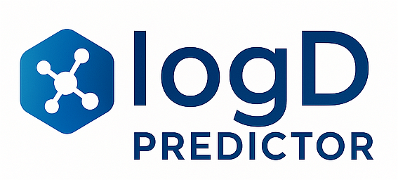
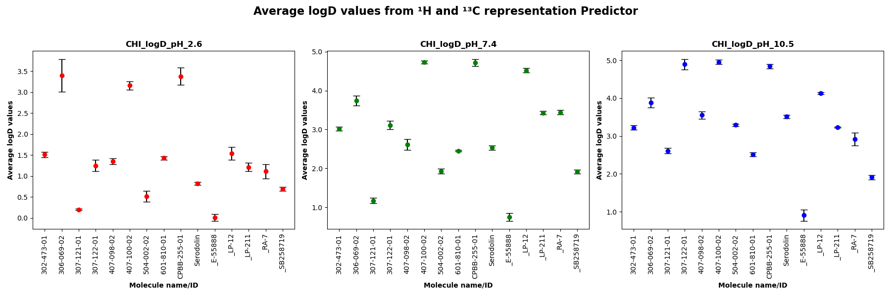

<p align="center"></p>

# logD Predictor

**logD Predictor** is a graphical software platform designed for accurate prediction of the **CHI logD** (Chromatographic Hydrophobicity Index) of chemical compounds — a chromatographic surrogate that is **experimentally and statistically equivalent to traditional logD** for comparative and modeling purposes. It leverages machine learning (ML) and deep neural network (DNN) models trained on **¹H and ¹³C NMR spectral representations**, as well as on **RDKit-derived molecular fingerprints**. LogD simulations can be carried out using individual ¹H and ¹³C spectra, or via a hybrid approach (¹H | ¹³C) that fuses these spectra into a single vector representation for prediction — **the hybrid method consistently delivers the best results**.

Unlike traditional cheminformatics tools, **logD Predictor integrates simulated NMR spectra** as compact, information-rich descriptors, providing a physicochemically grounded alternative to conventional fingerprint encodings. The software supports both **single-input** and **ensemble-based predictions**, offering flexibility for exploratory analysis and robust screening workflows.

All models were trained on datasets of **over 1200 real-world compounds** synthesized in **medicinal chemistry and drug discovery pipelines**, ensuring high applicability to pharmaceutically relevant chemical space. Through extensive hyperparameter optimization using the [Optuna](https://optuna.org/) framework, the best models consistently achieved **RMSE < 0.6** and **R² > 0.7** across multiple pH conditions — outperforming many traditional QSPR approaches.

**logD Predictor** combines scientific rigor with ease of use: the entire pipeline — from SMILES to logD — is operated via an intuitive GUI, requiring no coding skills from the user. Predictions are visualized, summarized, and exported with just a few clicks, making the tool suitable for both research and production settings in computational chemistry.

---

### 📖 Associated Research & Citation

*For more detailed information, check the original research paper:**
(placeholder for DOI and link after publication)

**If you use this software in your research, please cite our publication once available.**

---

## 📑 Table of Contents
- [Key Features](#-key-features)
- [Repository Structure](#-repository-structure)
- [Installation](#️-installation)
- [Running the Application](#-running-the-application)
- [Input File Format](#-input-file-format)
- [Prediction Options](#-prediction-options-via-gui)
- [Preview of the Interface](#-preview-of-the-interface)
- [Examples of Working Program](#-examples-of-working-program)
- [Related Projects](#-related-projects)
- [Troubleshooting](#-troubleshooting)
- [License](#-license)

---

## 💡 Key Features

- Spectral-based prediction using theoretical **¹H and ¹³C NMR** vectors or their **fused variant**
- Optional prediction from RDKit molecular fingerprints
- GUI-based interface for input, model selection, and result visualization
- Multi-model ensemble predictions with averaging across ML/DNN models
- Full support for Java-based NMR spectrum simulation via NMRshiftDB2
- **Low prediction error (RMSE < 0.6) and high R² (> 0.7) correlation coefficients across models**
- Models fully optimized via Optuna-based hyperparameter tuning
- Automatic chart generation and result export with customizable verbosity
- **Trained on compounds (more than 1200) synthesized in real-world drug discovery pipelines**

---

## 🗂 Repository Structure

```
logD_predictor/
│
├── logD_predictor_bin/                 # Core processing and GUI logic
│   ├── bucket.py                       # Buckets NMR spectra into predefined ranges
│   ├── csv_checker.py                  # Verifies input CSV structure, format, separators, decimal markers
│   ├── custom_header.py                # Adds consistent headers for bucketed NMR spectra
│   ├── concatenator.py                 # Concatenate the vectors from the 1H and 13C single-modal representations into a single fused bimodal vector.
│   ├── fp_generator.py                 # Generates RDKit molecular fingerprints (e.g. ECFP4)
│   ├── gen_mols.py                     # Converts SMILES strings to .mol files for NMR prediction
│   ├── logD_predictor.py               # Main GUI logic handler; manages file I/O and prediction logic
│   ├── merger.py                       # Merges bucketed ¹H and ¹³C spectra into combined matrix
│   ├── model_query.py                  # Prediction engine to querry saved models and get logD values
│   ├── predictor.py                    # Launches Java-based NMR spectrum prediction (via CDK .jar)
│   ├── CNN_predict.py                  # Predicts using CNN-based neural networks
│   ├── DNN_predict.py                  # Predicts using MLP-based deep networks
│   ├── SVR_predict.py                  # Loads and runs SVR models from joblib
│   ├── XGB_predict.py                  # Loads and runs XGBoost models from joblib
│   ├── install_modules.py              # Called by INSTALL.pyw to install required Python libraries
│   ├── install_text.txt                # Text displayed during GUI-based installation
│   ├── input_example.csv               # Example SMILES input file for testing GUI
│   └── joblib_models/                  # Directory to hold pre-trained model files (user must supply)
│
├── Prediction_Results/                # Automatically generated output folder for logs, plots, and CSVs
│
├── INSTALL.pyw                        # GUI-based Python library installer
├── START.pyw                          # Main launcher for the logD Predictor GUI
├── conda_environment.yml              # Conda environment definition file (create with `conda env export`)
├── README.md                          # This documentation file
├── RUN_LOG_FILE.log                   # Runtime log generated by the application
```

---

## ⚙️ Installation

### ✅ Option 1: Native Python (Windows 11)

1. Ensure that **Python ≥ 3.12** is installed on your system. You can download the latest version from [https://www.python.org](https://www.python.org).
2. Double-click `INSTALL.pyw` – it will install all required Python packages using `pip`.
3. Install **Java SDK** (tested on version 23). Ensure `java` and `javac` are accessible in your PATH.
4. Download the model archive:  
   [joblib_models.rar](https://sourceforge.net/projects/logd-predictor/files/joblib_models.rar/download)  
   - Extract and place the folder `joblib_models/` into `logD_predictor_bin/`.

---

### ✅ Option 2: Conda Environment

1. Use the provided environment file to create your Conda environment:
   ```bash
   conda env create -f conda_environment.yml
   conda activate predictor_logD
   ```
2. Install Java SDK and copy the `joblib_models` folder as above.

---

## 🚀 Running the Application

- **With native Python**: Double-click `START.pyw`
- **With Conda**:
  Navigate with `cd` command to the directory where `START.pyw` file is located. For example:

  ```bash
  cd D:\Git\logD_predictor
  ```
  Make sure you're running the script from the root directory of the project.
  Then activate conda environment and start LogD Predictor.
  ```bash
  conda activate predictor_logD
  python START.pyw
  ```

---

## 📄 Input File Format

The input should be a `.csv` file containing SMILES strings. Use the GUI's **"Open Input File Example"** button to see the required format. Example:

```csv
ID;SMILES
Mol01;CC(=O)Oc1ccccc1C(=O)O
Mol02;CCN(CC)CCOC(=O)c1ccc(C#N)cc1
...
```

- Columns must be **semicolon-separated (`;`)**.
- Headers must remain unchanged.
- The first column is molecule ID; second column is the SMILES string.

---

## 🧪 Prediction Options (via GUI)

After launching the graphical interface using `START.pyw`, the following configuration options are available:

### 🧬 Select Representation
Choose the input data representation used by the predictive models:
- **Hybrid ¹H|¹³C** - use hybrid bispectral representation for the best prediction results, but it's the slowest method.
- **Proton (¹H)** – use ¹H NMR spectra. Fast, but less acurate.
- **Carbon (¹³C)** – use ¹³C NMR spectra. Slower, more acurate.
- **RDKit FP** – use molecular fingerprints generated from SMILES, benchmarkt for testing and comparision.

### 🧠 Available Models
Specify which machine learning models to include in the prediction:
- **SVR** – Support Vector Regression models
- **XGBoost** – Gradient boosting tree models
- **DNN** – Multilayer Perceptrons (MLPs)
- **CNN** – Convolutional Neural Networks
- Selecting multiple options enables ensemble prediction and result averaging.

### ⚙️ Execution Options
Fine-tune runtime behavior of the program:
- **Quiet mode** – suppresses non-essential output messages (enabled by default)
- **Debug mode** – saves all temporary files, including intermediate MOLs and spectrum predictions
- **Show models** – prints detailed performance metrics (RMSE, MAE, R²) for each model after execution
- **Generate charts** – creates visual summaries of predicted logD values with standard deviations

Each option is accompanied by helpful tooltips in the GUI for ease of configuration. After selecting the CSV file and desired settings, simply click **Start Prediction** to begin the analysis.

---

## 🖼 Preview of the Interface

<p align="center">
  
</p>

---

## 🖥 Examples of Working Program

<p align="center"></p>
<p align="center"></p>
---

## 🔗 Related Projects

- [Demiurge (NMR processing backend)](https://github.com/Prospero1988/Demiurge)
- [Main NMR-AI Project](https://github.com/Prospero1988/NMR-AI_part3)

---

## 🛠 Troubleshooting

If you encounter any problems during installation or usage, feel free to contact the author.  
I will gladly assist with any technical issues related to environment setup, execution, or interpretation of results.

---

## 📜 License

This project is released under the **MIT License**.  
All scripts, models, and GUI tools are provided **free of charge** for academic and non-commercial use.
